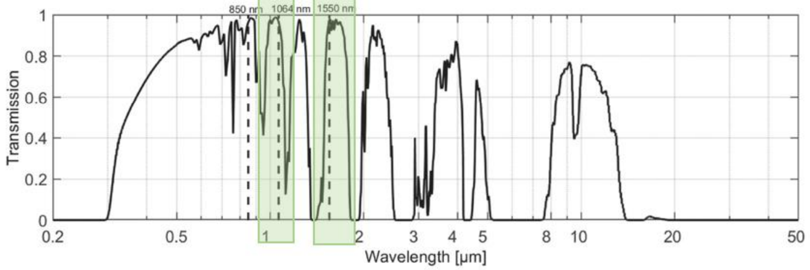
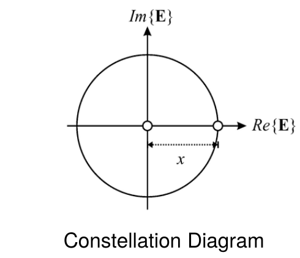
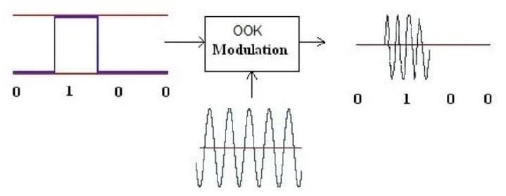
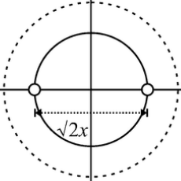
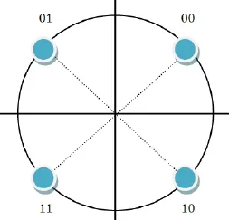
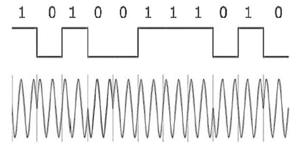
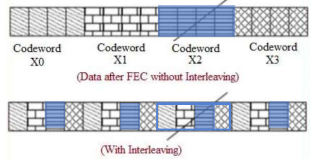
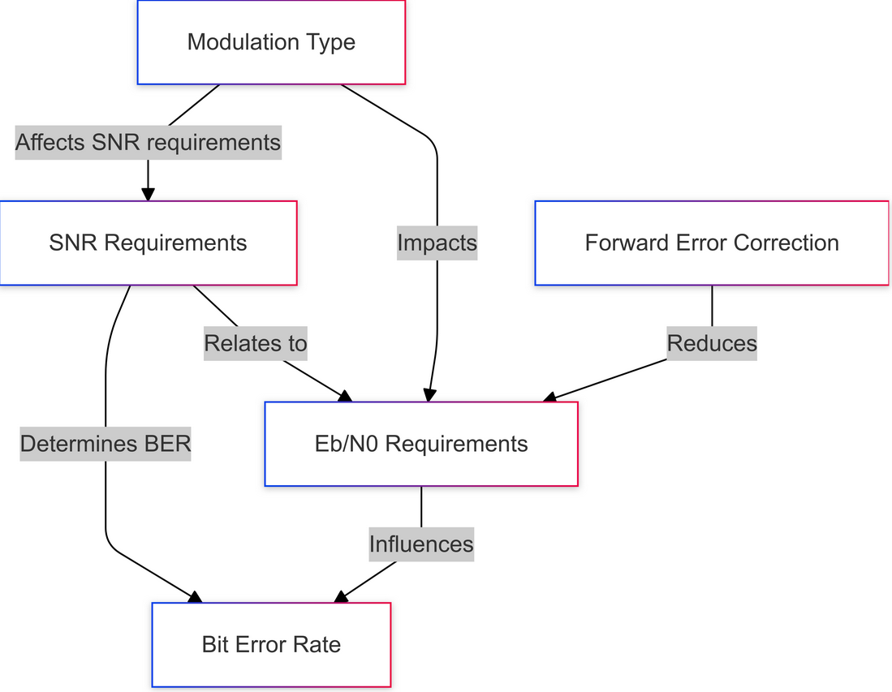
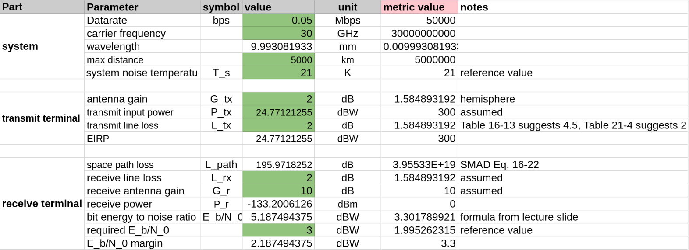

# Communication

authors @Leon Thomm, @Robin Ferella Falda 

# Communication Topologies

**Data Relay**

- European Data Relay System (EDRS)
    - currently 2 GEO satellites
    - mainly laser terminals, one has RF
    - no global coverage

**Direct-to-Earth**

- high-bandwidth data transfer from LEO

**Feederlinks**

- high-bandwidth data transfer to remote areas via GEO
- e.g., TV channels

also: *Network in the Sky*, *Deep Space*, *Constellations*

# Communication Links

<aside>
⚠️

**positive vs. negative losses**

The SMAD convention is that everything, including losses, is positive, yielding subtractions of losses in below $P_\text{rx}$ formula. The lecture did it the other way around. For example, in the lecture formulas, the numerator and denominator of the fraction in the path loss formula are swapped, yielding a negation because of the logarithm. I follow the SMAD.

</aside>

<aside>
⚠️

**db scale**

Often, but not always, one uses the logarithmic dB scale because it makes the computations easier. See the discussion on dB in the SMAD. Below, I will append [dB] where I assume values to be in dB scale.

- dBm means dBmW (as in milli-Watts)
- also, $\text{dB}\overset{-30}{\longrightarrow}\text{dBm(W)}$

In case you are confused that we are adding e.g., $x[\text{dBW}] + y[\text{dB}]$ note that it is equivalent to

$$
x[\text{dBW}]+y[\text{dB}]=10\log_{10}(x[W]) + 10\log_{10} (y[1])=10\log_{10}((xy)[W])
$$

so $y$ just amounts to a factor.

</aside>

Given / assumed params are gray. Generally, the received power is:

$$
P_{\text{rx}}[\text{dBW}]=\underbrace{\overset{\begin{smallmatrix}\text{transmit}\\
\text{power}\\
\\\end{smallmatrix}}{P_{\text{tx}}[\text{dBW}]}-\overset{\begin{smallmatrix}\text{transmit}\\
\text{loss}\\
\\\end{smallmatrix}}{L_{\text{tx}}[\text{dB}]}+\overset{\begin{smallmatrix}\text{transmit}\\
\text{antenna gain}\\
\\\end{smallmatrix}}{G_{\text{tx}}[\text{dB}]}}_{\text{EIRP}}-\overset{\begin{smallmatrix}\text{propagation}\\
\text{loss}\\
\\\end{smallmatrix}}{L_{\text{path}}[\text{dB}]}+\overset{\begin{smallmatrix}\text{receive}\\
\text{antenna gain}\\
\\\end{smallmatrix}}{G_{\text{rx}}[\text{dB}]}-\overset{\begin{smallmatrix}\text{receive}\\
\text{loss}\\
\\\end{smallmatrix}}{L_{\text{rx}}[\text{dB}]}
$$

with free space path loss $L_\text{path}=10\log_{10}\left(\left(\frac{4 \pi r}{\colorbox{gray}λ}\right)^2\right)$, and

<aside>

RF

For a parabolic reflector, with antenna diameter $D$ [m], wavelength $\lambda$ [m] and efficiency $\eta$, the general gain formula is

$$
\small G
=\eta\left(\frac{\pi \colorbox{gray}D}{\colorbox{gray}λ}\right)^2
$$

- SMAD details
    
    There are two ways of characterizing the gain:
    
    - using the effective aperture $A_e$ [m²] → SMAD formula 16-8
    - using the antenna diameter $D$ [m] → SMAD formula 16-9 & 16-10
    
    We use the latter approach, but the SMAD formula 16-10 assumes $f$ in GHz, whereas wee consider Hz, which changes the first value.
    

which yields

$$
\begin{aligned}
G[\text{dB}]&=\begin{smallmatrix}10\log_{10}\left(\left(\frac{\pi\colorbox{gray}D}{\colorbox{gray}λ}\right)^{2}\right)+10\log_{10}\left(\colorbox{gray}η\right)\end{smallmatrix}\\&=\begin{smallmatrix}-159.59+20\log_{10}(f)+20\log_{10}(\colorbox{gray}D)+10\log_{10}(\colorbox{gray}η)\end{smallmatrix}
\end{aligned}
$$

- compare SMAD table 21-6
    
    note that the table consider $\eta$ a factor of the logarithm, but it seems to be a mistake considering formula 16-10, so above formulation should be preferred.
    

Might need to consider ~0.5dB polarization loss additionally in $L_\text{path}$.

</aside>

<aside>

Laser (lecture only)

$$
\small G_\text{tx}[\text{dB}]=10 \log _{10} \left(\frac{8}{(\colorbox{gray}{M}^2 \frac {1.22\colorbox{gray}λ}{\colorbox{gray}A_\text{tx}})^2}\right)
$$

for an optical terminal, where $M$ is the *quality factor*.

$$
\small G_\text{rx}
=\text{<same as RF>}
$$

</aside>

Now let’s examining the differences between the two technologies in more detail.

**Radio Frequency (RF) communication**

- somewhat weather independent
- efficient, can talk to end users directly
- low bandwidth due to lower frequency
- standardization: established
(CCSDS)
- ~10kHz - 10GHz
- ~a few kg
- ~50W (rough order of magnitude)
- must satisfy a given signal-to-noise ratio (SNR): ($P$ NOT in dB)
    
    $$
    \small \text{SNR}=\frac{P_\text{rx}}{N}
    $$
    
    for noise $N$.
    
    🚧 Various formulas for this value circulate on lecture slides and in SMAD.
    
    - definition on lecture slides
        
        compare to SMAD (21-5)
        
        $$
        \small \frac{E_b}{N_0}= P_\text{rx}-10\log_{10}(f_b)+228.6 - T
        $$
        
        in dB, where $E_b = P_\text{rx} - 10\log_{10}(f_b)$ is the energy per bit ($f_b$ is bitrate), and $N_0$ is the noise approximated by $T-228.6$ with the system noise temperature $T$ in dBK.
        
- another common measure is the *effective isotropic radiated power* (EIRP)

$$
\text{EIRP}=P_\text{tx} - L_\text{tx} + G_\text{tx}
$$

**Optical (incl. Laser) communication**

- weather dependent
- needs dedicated laser terminals
- high bandwidth
- standardization: ongoing
(CCSDS-OPT vs. SDA)
- ~200 THz
- ~10s of kg, up to 150kg
- ~50W (rough order of magnitude)
- must satisfy a given optical signal-to-noise ratio (OSNR): ($P$ NOT in dB)

$$
\text{OSNR}=\frac{P_\text{rx}}{P_\text{noise}}
$$

…or in dB: $10\log_{10}\left(\frac{P_\text{rx}}{P_\text{noise}}\right)$

🚧 A formula for $P_\text{noise}$ is on the lecture slides, but I didn’t understand it.

- spectra
    
    The EM spectrum is organized in bands, there exist several standards for RF. We consider IEEE.
    
    
    
    Laser comm is more sensitive to atmospheric interaction, and today terminals mostly use the spectrum around 1550nm. This spectrum is divided into 100GHz bands by the ITU.
    
    
    
- Laser Links - Block Diagram
    
    
    

# Modulation Techniques

We transmit information over EM waves by *modulating* a *carrier* wave with fixed frequency.

While the carrier fixed, the set of frequancies that make up the final signal (via inverse Fourier) create *sidebands* around the carrier frequency. The span of frequencies is the *bandwidth*.

- Constellation Diagrams
    
    
    …illustrate a space of phases and amplitudes used in a certain modulation scheme.
    
    On the right is the state space of OOK, where the signal is either the carrier without phase shift (angle 0), or has no amplitude (i.e., no signal).
    
    
    

**On-Off-Keying (OOK)**

The bitstream is directly multiplied with the carrier signal.

**Pulse-Position-Modulation (PPM)**

The signal is interpreted in chunks of length $l$ (here $l=8$). Only one value is 1 in each chunk. Hence, a chunk encodes $\log_2 l$ bits.

Can be more effective than OOK because we only need one pulse per $\log_2 l$ bits, allowing it to contain more energy and be more robust to noise.

**Differential Phase Shift Keying (DPSK)**

We select a number $2^k$ of states in the constellation diagram, each encoding $k$ bits.

- efficient, allows for less energy or more data
    - QPSK provides ~2dB gain over OOK
- but complex to implement, expensive equipment

Simple DPSK only modifies the phase shift, but more complex DPSK can also modify the amplitude (i.e. the radius from the origin in the constellation diagram).

BPSK (binary)

QPSK (quadrature)

BPSK example

# Error Correction

**Forward Error Correction (FEC)**: encode additional bits (”checksum”) to allow verification of data integrity at the receiver side, and often correction of small errors. This leads to a *code rate*

$$
r=\frac{\text{\#bits}_\text{payload}}{\text{\#bits}_\text{payload}+\text{\#bits}_\text{redundancy}}
$$

**Backward Error Correction (BEC)**: uses [NACKing](https://en.wikipedia.org/wiki/Acknowledgement_(data_networks)), hence requires two-way communication.

**Interleaving** mixes chunks of consecutive data with some added redundancy.

- allows rather cheap reconstruction of original data in case of local errors
- increases latency, needs more memory

It’s like a RAID computer backup system, but interleaving is across time not servers.

## BER, FEC, Eb/No, SNR interconnection

# Link Budgets

RF link budget example