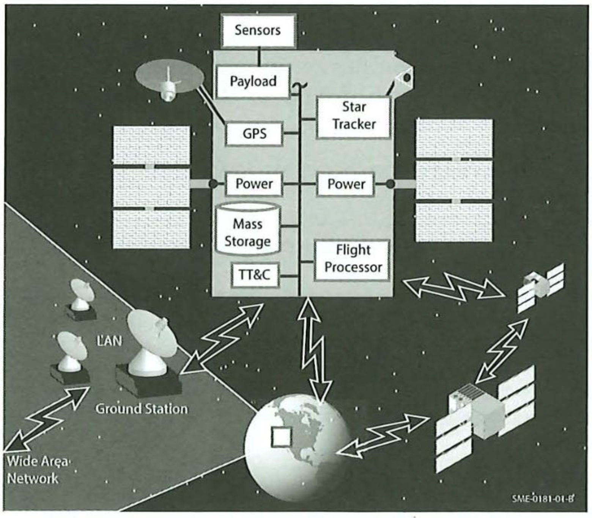

# Controls & Computing

# **Learning Outcomes**

Get to know *issues and options* of **On-Board Processing**

**Understand** system *design characteristics* of **software**

**Understand** architecture *types* and also modern
implementations

**Discuss** software *development* **challenges**

# Failures

<aside>
💥

**Top 3 Failures:** Software, Voltage, Launch

</aside>

## Whats the commonality between Beresheet, Mars Climate Orbiter, and Astro-H?

They all malfunctioned because of software issues:

**Beresheet (Israeli Moon Lander)**

- A sensor malfunction triggered a software command
- This command unexpectedly shut down the main engine
- The lander crashed due to lack of engine power during descent

**Mars Climate Orbiter**

- Ground software used imperial units instead of metric
- This mismatch caused incorrect trajectory calculations
- The spacecraft entered Mars’ atmosphere at the wrong angle and disintegrated

**Astro-H**

- Faulty software misread the satellite’s rotation
- Attitude control system overcompensated, causing a spin
- Incorrectly configured thrusters worsened the spin, leading to breakup

<aside>
🛠

That's why we need good design and thorough testing

</aside>

# Computer Systems

Think of mission computer systems of all components, from the spacecraft itself, to development tools and testing systems. 

Mission Computer Systems have many interfaces. Managing these interfaces and keeping them interoperable uses a lot of resources. 

<aside>
⚠️

**Flexibility**

Having a **flexible** **system** has its advantages, but it’s also is usually much more **complex** than something that does only **one thing** *right*

</aside>

Below you can find a hierarchy of the three pillars, Hardware, Software and Documentation:

## **Hardware**

- Hardware Configuration Item (HWCI)
- Computer Board
- Computer Chip Set/Analog
Devices/Logic Components/Discrete
Components

## **Software**

- Computer Software
Configuration Items (CSCls)
- Computer Software
Components (CSCs)
- Computer Software Unit

## **Documentation**

- Requirements Specification
- Design Documents
- Detailed Design Documents
- Interface Control
Documents (ICDs)

## Design Drivers in Computer Systems

<aside>
⚠️

When flowing down mission requirements, we must be careful to design hardware and software with the “ilities” in the fourth column in mind

</aside>

| **Mission Requirements** | **System Level Processing Requirements** | **Computer Level Requirements** | **Additional Requirements ("ilities")** |
| --- | --- | --- | --- |
| - Customer Needs
- Expected Availability
  - Weeks
  - Months
  - Year or more
- Number of Satellites
- Number and location of ground stations
- Level of Autonomy
- Security Requirements 
- Programmatic Issues
- Cost
- Schedule
- Risk | - Functional Capabilities
- Processing Partitioning
- Payload vs. Spacecraft
- Onboard vs. Ground
- Physical Characteristics
- Size
- Weight
- Power
- Radiation
- Communication Protocol
- Commercial Digital Standards
- Commercial Analog Standards
- Protection / Encryption | - Throughput
- Memory
- Radiation Hardness
- Development Tools
- COTS Software availability
- Emulator / Engineering Model availability | - Testability
- Feasibility
- Usability
- Reusability
- Reliability
- Flexibility
- Maintainability
- Interchangeability
- Replaceability |

## System Requirements for Computer Systems

We can approach the system requirements definition by asking the following questions:

| **Questions to Ask** | **Parameters to Review** |
| --- | --- |
| **What Must The System Do?** | Evaluate and establish basic functional requirements. |
| **Why Must It Be Done?** | Establish traceability from functions to mission objectives. Be sure to challenge the requirements and assess their validity. |
| **How Can We Achieve It and What Are The Alternatives?** | Evaluate candidate architectures including network topology, data flow, control flow, and UML diagrams. Investigate emerging technologies and perform trade studies as needed to ensure a robust solution. A combination of traditional architectures is an acceptable "hybrid" solution. |
| **What Functions Can We Allocate to Which Parts of the System?** | Perform functional partitioning to development block diagrams of ground station and vehicle, as well as spacecraft and payload. |
| **Are All Functions Technically Feasible?** | Determine if the value of state-of-the-art technology outweighs the risk. Evaluate the potential use of off-the-shelf hardware and software. Look for data flow bottlenecks and reallocate functions to evenly distribute the data flow. Review baseline block diagrams for potential holes. |
| **Is The System Testable?** | Develop non-intrusive test plans and procedures that ensure the system will meet mission objectives. Are test points available outside the system for easy "black-box" testing? |

## Computational Architectures

### Centralized Topology

In a centralized topology, units connect directly to a central hub or management computer, offering high reliability for a limited number of well-defined subsystems.

However, it requires extensive wiring and makes adding new components complex, needing additional wiring and software updates.

### Ring Topology

A Ring Topology allows data to travel around a ring, delivering the same information to multiple nodes. It uses smaller, distributed wiring harnesses, ideal for spacecraft layouts. 

However, ***each transmission relies on the previous node,*** which can be a limitation if a node fails.

## Testing Computersystems

<aside>
🛰️

**You can use *flatsats* or testbeds that fully integrate sensors, hardware interfaces and allow for testing “as system.”** This makes it possible to inject all nominal and off-nominal data at interfaces.

Test bed persists after launch and becomes ground-test opportunities before uploads into space

</aside>

What is testing: Testing starts with low-level **software (unit, module)** and **hardware (component, acceptance)** tests, progresses to **stand-alone functional tests** for ground- and space-based systems, and culminates in **system integration, testing, and on-orbit calibration**, verifying mission requirements.

# Key Characteristics and Challenges

- Traditionally, there is limited power and limited mass. Sometimes, also
size limitations
- Speed of processor limits/enabled options of computational system
- Size and type of storage
    - Size of instruction memory
    - Size of storage
- Most Earth-based storage capabilities are not hard

# **Key Computation Options**

1. Spacecraft Ephemeris
    - Interpolation of Hermitian Polynomials
    - Onboard propagator using Doppler shifts
    - GPS signals
2. Star trackers
    - Digital trackers outputting full quaternions
    - Picture-based with onboard catalog
3. Filesystems
    - None (for simpler systems)
    - Fully fledged (for complex missions

# Software Issues and Challenges

- High labor costs
- Delayed testing in integration flow
- Shortage of skilled software engineers
    - Continuous workload post-launch
    - Poor cost estimation

<aside>
🚨

Spacecraft design often focuses on hardware, leading to reactive software development

</aside>

# Software Architecture Options

## Layered Services

- Standard API for each layer and service
- Encapsulated implementation details
- Allows for internal changes without affecting other layers

## Bus Architecture

- Standard-sized, message-oriented communication system
- Minimizes interdependencies
- Enables independent testing and “plug and play” capabilities

## Core Flight System (cFS)

- NASA-developed reusable software framework
- Modular architecture for scalability and portability

# Controls + Computing Summary handwritten

[https://drive.google.com/file/d/17y8FClK89jioalq_K4p5-qYetWLbv9Em/view?usp=sharing](https://drive.google.com/file/d/17y8FClK89jioalq_K4p5-qYetWLbv9Em/view?usp=sharing)