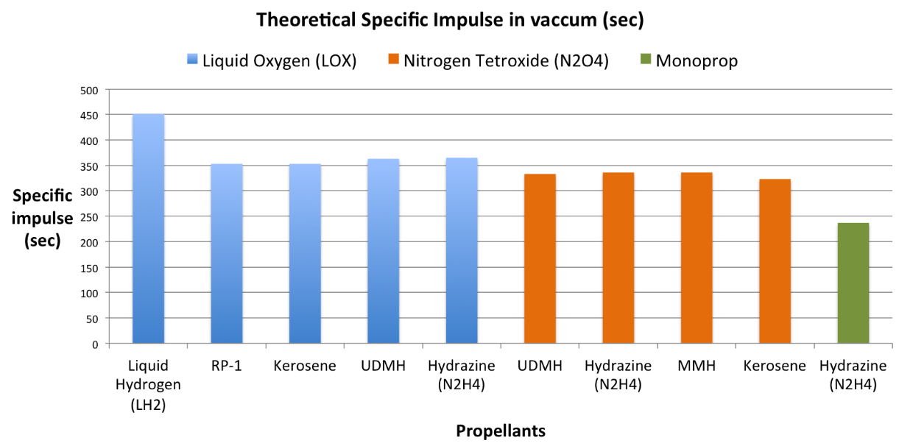

# DRAFT: Launch Operations

### **Abstract**

The lecture on **Launch, Ascent, and Entry Operations** provided a detailed examination of the phases of spacecraft launch and re-entry, the dynamics involved, and the critical technologies. Topics included launch site logistics, propulsion principles, multistage rockets, rendezvous techniques, interplanetary travel strategies, and atmospheric re-entry mechanisms. The key objective was to underscore the challenges and methodologies involved in achieving mission success from Earth's surface to space and back.

---

### **General Concepts**

### **Launch Site Logistics**:

- The selection of launch sites considers orbital inclinations, geographic constraints, and infrastructure capabilities​​.
- Pre-launch operations involve ground support equipment (GSE) design, scheduling, and compliance with safety standards.

### **Spacecraft Propulsion**:

- The Tsiolkovsky rocket equation governs ΔV and mass ratios​.
- Efficiency is measured by the specific impulse (Isp)
    
    
    
    Overview over the different Isps of different propellants
    
- For a LEO Launch with 4.5km/s exhaust velocity the mass ratio is about 10 → 90% of the mass is propellant
- Different types of Propulsion Systems were discussed:
    - CH4 + LOX
    - Nuclear rocket engine
    - Electric/Ion Propulsion
    

### Launch and ascent to orbit

- Orbit insertion: Bringing the spacecraft to a stable orbit
- On different planets with different Atmospheres need different launch angles

- Inclination and launch latitude: The minimum inclination of a spacecraft is the latitude of the launchpad. If the rocket launches eastwards (prograde Orbit) the earth rotation velocity can also be used.
- 
1. **Multistage Rockets**:
    - Dividing the propulsion system into stages optimizes the payload-to-orbit ratio​.
2. **Rendezvous and Docking in Low Earth Orbit (LEO)**:
    - Techniques like Hohmann transfer and phasing maneuvers are crucial​.
3. **Interplanetary Travel**:
    - The patched conics method simplifies trajectory planning, leveraging the sphere of influence (SOI) for celestial bodies​​.
4. **Atmospheric Re-entry**:
    - Methods such as skip entry reduce thermal loads​.
    - Thermal protection systems (TPS) are essential for managing the heat generated during re-entry.

---

### **Facts to Memorize**

- **ΔV Calculation**: ΔV=ve​ln(mi​/mf​), where ve​ is the exhaust velocity, mi​ and mf​ are initial and final masses.
    
    ΔV=veln⁡(mi/mf)\Delta V = v_e \ln(m_i/m_f)
    
    vev_e
    
    mim_i
    
    mfm_f
    
- **Specific Impulse**: Isp​≈450s for cryogenic engines (LH2/LOX).
    
    Isp≈450sI_{sp} \approx 450s
    
- **Mass Ratios**: For 10 km/s velocity, 90% of the rocket's initial mass is propellant.
- **Launch Inclinations**: Launch sites near the equator (e.g., Kourou) allow inclinations down to 0°​.

---

### **Important Formulas**

1. **Tsiolkovsky Rocket Equation**:
    
    $ΔV = v_e \ln\left(\frac{m_i}{m_f}\right)$
    
    - Relates the change in velocity to mass and engine exhaust velocity.
    
    With drag force and the gravity loss the formula looks like this:
    
    $\Delta V = g I_{sp} \log_e \left( \frac{m_i}{m_f} \right) - \left( \int_{t_0}^{t_f} g \sin{\gamma} \, dt + \int_{t_0}^{t_f} \frac{D}{m} \, dt \right)$
    
    with: 
    
    D: Drag force in Newton
    
    $\gamma$: flight path angle (angle from horizontal)
    
    
    
2. **Mass of propellant for a given $\Delta v$**
    
    $$
    \Delta V = g I_{sp} \log_e\left(\frac{m_i}{m_f}\right) \implies 
    \begin{cases} 
    m_p = m_i \left[1 - \exp\left(-\frac{\Delta V}{g_0 I_{sp}}\right)\right] \\ 
    m_p = m_f \left[\exp\left(\frac{\Delta V}{g_0 I_{sp}}\right) - 1\right] 
    \end{cases}
    $$
    
    With 
    
    $m_i :$  initial mass
    
    $m_f :$  final vehicle mass
    
    $m_p = m_i - m_f$
    
3. $a_{Drag} = \frac{1}{2}\rho v^2\frac{C_D A_n}{m} = \frac{1}{2}\rho v^2 \times \frac{1}{BC}$ 
    
    with:
    
    $\rho: Density (kg/m^{3}) \\
    V: Velocity (m/s)\\
    C_D: Drag \space coefficient\\
    A_n: Reference \space area (m^{2})\\
    BC: Ballistic \space coefficient (kg/m^{2})$
    
     
    
4. **Specific Impulse**:Isp​=m˙g0​F​
    
    Isp=Fm˙g0I_{sp} = \frac{F}{\dot{m}g_0}
    
    - Describes engine efficiency, where F is thrust, m˙ is propellant mass flow rate, and g0​ is standard gravity.
        
        FF
        
        m˙\dot{m}
        
        g0g_0
        
5. **Orbital Velocity**:v=μ(r2​−a1​)
    
    v=μ(2r−1a)v = \sqrt{\mu \left(\frac{2}{r} - \frac{1}{a}\right)}