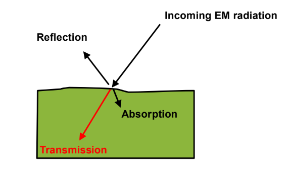

# Earth Observation

### **Abstract**

This document outlines key concepts of remote sensing, its methods, and applications in Earth observation. It includes an overview of various EO missions, detailing the types of sensors, data collection processes, and the interpretation of remote sensing data. Emphasis is placed on understanding natural phenomena, mapping hazards, and utilizing EO for geoscience applications. Advanced missions and technologies like radar altimetry, hyperspectral imaging, and LiDAR are described, along with examples of their use in environmental monitoring and disaster management.

---

### **1. Remote Sensing: Core Concepts**

- **Definition**: The process of **gathering data about objects without physical contact**, primarily using sensors that detect reflected or emitted EM radiation.
- **Importance**:
    - Enables the study of **inaccessible areas.**
    - Supports regional trend analysis and interdisciplinary research across geology, agriculture, climate science, etc.

### **2. Electromagnetic (EM) Radiation Interactions with Materials**

- **Absorption**: Converts **incoming EM waves to heat or other energy forms**; intensity depends on material properties.
- **Reflection**:
    - **Specular**: Smooth surfaces reflect uniformly.
    - **Diffuse**: Rough surfaces scatter light in multiple directions.
- **Transmission**: EM radiation passes through materials without altering its frequency; influenced by surface and material properties.

### **3. Atmospheric Effects**

- EM radiation interacts with atmospheric molecules, aerosols, and dust via:
    - **Rayleigh Scattering**: particles much smaller than the wavelengths (e.g., blue sky).
    - **Mie Scattering**: Occurs with particles similar in size to wavelengths.
    - **Non-Selective Scattering**: Larger particles scatter all wavelengths, causing cloud appearance.
- **Atmospheric Windows**: Specific wavelength ranges that pass through the atmosphere with minimal interference, crucial for remote sensing.

### **4. Active vs. Passive Remote Sensing**

- **Passive**: Relies on natural EM sources like sunlight.
- **Active**: Employs artificial EM sources (e.g., radar) for precise measurements and independence from sunlight. (allow to measure the distance with a single measurement)

### **5. Resolutions in EO Imaging**

- **Spatial/Geometric**: Clarity depends on pixel density (e.g., higher resolution allows finer detail in glacier imagery).
- **Radiometric**: Sensitivity to detect variations in intensity levels.
- **Spectral**: Ability to distinguish finer wavelength intervals; higher spectral resolution provides detailed material composition data.
- **Temporal**: Time intervals between repeated images; critical for monitoring dynamic phenomena like wildfires.

Spatial

Radiometric

Spectral

Temporal

### **6. Examples of Earth Observation Missions**

- **ESA Copernicus Program**:

The Copernicus Programme is the world's largest Earth observation initiative. It provides accurate, timely, and easily accessible data from satellites and in-situ sensors to monitor and manage the environment, understand climate change, and ensure civil security.

- Includes Sentinel satellites for monitoring environmental and security applications.
- Provides open-access data for scientific and policy use.
- **Landsat Program**:
    - Longest-running EO mission, with Landsat 9 launched in 2021.
    - Features multispectral imaging (15m–100m resolution) with a 16-day global repeat cycle.
    - Landsat Next aims to achieve a resolution of 10m and 26 Bands
- **Meteosat**:
    - Geostationary satellites for meteorology, operational since 1977.
    - Key for weather prediction with MVRI sensors covering visible to infrared wavelengths.
- **Nimbus:** Sun synchronous passive microwave radiometer in the 1960s
- **Photogrametry Satellites:**
    - TERRA (NASA)(satellite with 5 instruments onboard) with the ASTER Instrument
    - ALOS (JAXA) Horizontal resolution of approx. 30m
- **ICESat-2**:
    - Uses advanced **laser altimetry** to measure surface elevation and ice dynamics.
- Radar Altimetry: Mesuring the surface along the satellite track, Height can be calculated
- Gravity field measurements: GRACE: Two identical spacecrafts which flew after another. Distance between them allowed gravity mapping
- Imaging Radar: Synthetic Aperture Radar (SAR)

### Classification of objects from space

- Analysis of the reflection spectrum gives evidence about the rocktype or objects composition

### **7. Applications in Hazard Monitoring**

- EO supports natural hazard detection and monitoring, such as:
    - **Thermal Infrared (TIR)** imaging for volcanoes and wildfires.
    - **Radar Altimetry** for sea-level rise and flood assessments.
    - **Digital Elevation Models (DEMs)** to map terrain features and fault lines.
    - **SAR:** Mapping the impact of floods
    - **InSAR:** Measuring deformations from earthquakes
    - NASA ARIA: Combination of radar, optical, gnss and seismic observations for earthquake response.

### 

---

### **Facts to Memorize**

1. **Key Interactions**:
    - Reflection: Smooth = specular; Rough = diffuse.
    - Absorption and Transmission: Material-dependent.
2. **Atmospheric Effects**:
    - Rayleigh scattering = particles smaller than wavelength(e.g., blue sky).
    - Mie scattering = Same size
    - Non-selective scattering: Particles larger than wavelength
3. **Resolution Types**:
    - Spatial: Pixel density.
    - Radiometric: Sensitivity to intensity.
    - Spectral: Wavelength detail.
    - Temporal: Frequency of imaging.
4. **Example Missions**:
    - **Copernicus (ESA)**: Sentinel satellites.
    - **Landsat**: Multispectral imaging, continuous since 1972.
    - **ICESat-2**: Laser altimetry for surface measurements.

---

### **Important Formulas**

1. **Net Radiation Balance**:
    
    $R_n = (1 - \alpha_s) K_\downarrow + I_a - \varepsilon \sigma T_s^4$
    
    - **Components**:
        - $\alpha_s$: Surface albedo.
        - $K_\downarrow$: Incident solar radiation.
        - $I_a$: Downward atmospheric radiation.
        - $\sigma$: Stefan-Boltzmann constant (5.67×10−8).
        - $T_s$: Surface temperature.

---