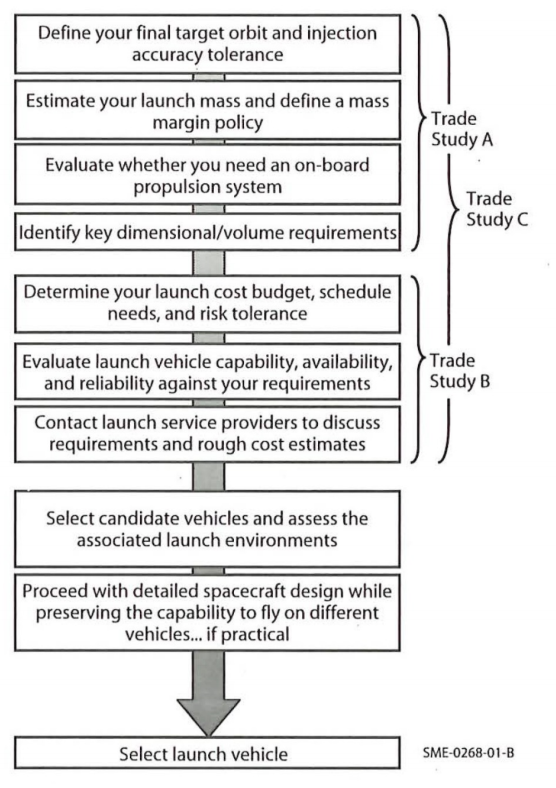

# Launch Vehicles

## **Abstract**

The evolution of launch vehicles from the 1940s has seen transformative advancements, beginning with **military rocket technology** during World War II and progressing to **modern reusable rockets**. Early developments like Germany's **V-2 rocket** laid the groundwork for space exploration, while the **Cold War space race** between the USA and USSR spurred innovation. The post-1990s era saw a transition to **commercialization**, with private companies like **SpaceX** revolutionizing costs and reusability. Each era emphasized improving reliability, payload capacity, and accessibility.

---

## Historical overview

1. **1940s: Pioneering Rocket Technology**:
    - **Germany's V-2 Rocket**: The world's first long-range guided ballistic missile (1944), foundational for modern rocketry.
    - Post-war, the US and USSR acquired German rocket technology, leading to the **Redstone** (US) and **R-7 Semyorka** (USSR) programs.
2. **1950s: Dawn of the Space Age**:
    - The USSR launched **Sputnik 1** (1957), the first artificial satellite, using the R-7 rocket.
    - The USA responded with **Explorer 1** (1958) using the **Juno I** rocket.
    - Both nations focused on modifying military rockets for space exploration.
3. **1960s: The Apollo Era and Heavy-Lift Rockets**:
    - Development of **Saturn V** (USA): Capable of delivering payloads to the Moon, it remains the most powerful rocket ever built.
    - USSR's **N1 rocket** attempted to rival Saturn V but failed to achieve operational status.
    - Advances in **multi-stage rocketry** allowed heavier payloads and missions beyond Earth's orbit.
4. **1970s: Space Stations and Reusability Concepts**:
    - The USSR's **Proton** rocket launched the **Salyut** space stations, solidifying its role as a heavy-lift vehicle.
    - Early concepts for reusability emerged, leading to the development of the **Space Shuttle** (USA).
5. **1980s: Emergence of Modular and International Launch Systems**:
    - Europe introduced the **Ariane** series, focusing on commercial satellite deployment.
    - China's **Long March** rockets entered the global market.
    - The Space Shuttle became the first reusable spacecraft but faced challenges like the **Challenger disaster** (1986).
6. **1990s: Commercialization and International Cooperation**:
    - The fall of the USSR enabled Russian rockets like **Soyuz** and **Proton** to enter the global market.
    - The **Commercial Space Launch Act (1984)** in the US encouraged private-sector involvement.
    - **Delta II** and Atlas II/III became workhorses for satellite launches.
7. **2000s: Reusability and Private Innovation**:
    - **SpaceX** emerged with the **Falcon 1** (2008), followed by the reusable **Falcon 9**.
    - Focus shifted to cost reduction and increasing launch cadence.
    - Smaller rockets, such as **Rocket Lab's Electron**, targeted the nanosatellite market.
8. **2010s-Present: Reusability and Heavy-Lift Advances**:
    - SpaceX's **Falcon Heavy** and **Starship** redefined payload capacities.
    - Blue Origin’s **New Shepard** and **New Glenn** expanded reusability efforts.
    - **International competition** intensified with India's **PSLV**, Japan's **H-IIA**, and China's **Long March** series achieving global prominence.

## **Current Launch Vehicle Landscape**

- Major Western launch systems: Delta IV, Atlas V, Falcon 9, Vulcan Centaur, and Ariane 6.
- Advances in reusable rockets led by SpaceX (Falcon 9 and Falcon Heavy).
- Focus on cost reduction, higher efficiency, and modular designs to meet diverse mission profiles.

## **Key Launch Vehicle Design and Performance Factors**

- Propulsion technologies: Liquid-fueled systems (e.g., hydrolox) offer high efficiency but require cryogenic handling, while hypergolic propellants provide simplicity and storability but are crazy toxic!
- Engine cycles (e.g., dual-combustion chamber RD-180 vs. methane-based BE-4).
- Modularity and scalability for payload adaptability like the Ariane 6.

## Launch vehicle selection

### **Orbit accuracy:**

- Accuracy is hard to quantify but there are some principles:
    - Solid upper stages are less precise than liquid ones
    - Long burning upper stages are less precise than short burning ones
    - smaller engines are more precise than large ones.

Different launchers (and launchpads) are specialised for different orbits. In the following image it is visible that Ariane 6 is better for a GTO while the falcon 9 is better for the ISS.

Different mission types have different requirements for launchers.

Science Missions with a unique instrument are willing to accept schedule risks and a higher price but do not accept technical risks. A constellation satellite does accept technical risk and schedule risk but does not accept higher costs. 

<aside>
💡

**Excursion Launch Phases**

| **Phase** | **Key Events** | **Approx. Altitude** |
| --- | --- | --- |
| Liftoff | Ignition, tower clearance | 0–1 km |
| Max Q | Max aerodynamic pressure | ~10–15 km |
| Stage Separation | Spent stage jettisoned | ~40–100 km |
| Upper Atmosphere | Fairing jettison, near-vacuum flight | ~100–200 km |
| Orbital Insertion | Achieving orbital velocity | ~200 km or higher |
| Payload Deployment | Release of satellite or spacecraft | Target orbit altitude |
</aside>

## **Vibrations and Structural Considerations**

- Vibrational loads (sinusoidal and random) and acoustic stresses during ascent.
    - **Sinusoidal Vibrations**:
        - Narrow-band vibrations caused by engine resonances and structural dynamics.
        - Persistent during the entire burn phase of a rocket stage.
    - **Random Vibrations**:
        - Broad-spectrum excitations caused by turbulent airflows, engine combustion, and rocket dynamics.
        - Prominent during key phases like liftoff.
- Importance of dynamic coupling and resonance management between spacecraft and launch vehicle.
    - **Dynamic Interaction**
        - Spacecraft and launch vehicle form a **single dynamic system**, where resonances must be avoided.
        - Resonance occurs when natural frequencies of spacecraft components align with launch vehicle-induced frequencies.
    - **Avoiding Resonances**
        - Design spacecraft such that its fundamental frequencies are **higher** than those of the launch vehicle.
    - **Coupled Load Analysis**
        - Conduct simulations to identify critical resonances and ensure decoupling.
- The Spacecraft further needs to be able to persist the enormous acoustic loads.
    - **Sources**:
        - Engine noise and aerodynamic effects create high acoustic pressures during liftoff and max-Q.
    - **Mitigation Strategies**:
        - Acoustic blankets in payload fairings (e.g., Falcon 9: 4–6 dB reduction).
- Load factor limits imposed by axial  and lateral stresses (90° off the flight direction) and techniques for shock mitigation.
- Rules of thumb:
    - Larger launch vehicles have smaller sinusoidal vibrations than smaller ones
    - Smaller launch vehicles have smaller acoustic loads than larger ones
- During a Launch there are different shocks on the spacecraft (sorted from high shocks to low):
    - Spacecraft separation
    - Fairing deployment
    - Stage separation
    - Booster separation
    - Release of LV hold-down at liftoff
    

---

## **Key Facts to Memorize**

- **V-2 Rocket (1944)**: First long-range ballistic missile; foundational for space technology.
- **Sputnik 1 (1957)**: First artificial satellite, marking the start of the Space Age.
- **Saturn V (1967-1973)**: Most powerful rocket, instrumental in the Apollo Moon landings.
- **Space Shuttle (1981-2011)**: First partially reusable spacecraft, despite high costs and risks.
- **Falcon 9 (2010)**: Revolutionized the industry with reusability and lower costs.
- **Proton and Soyuz**: Workhorses of the Russian space program, critical for both national and commercial missions.

---

## **Important Formulas and Metrics**

1. **Rocket Equation (Tsiolkovsky)**:
    - $Δv= v_e \ln \left(\frac{m_0}{m_f}\right)$
    - Describes the relationship between a rocket’s change in velocity (Δv), exhaust velocity (ve​), and the initial (m0​) and final (mf​) masses.
2. **Payload Fraction**:
    - $Payload Fraction= \frac{\text{Payload Mass}}{\text{Total Launch Mass}}$
    - Key metric to evaluate efficiency.
3. **Cost-per-Kilogram to Orbit**:
    - $Cost Efficiency= \frac{\text{Total Launch Cost}}{\text{Payload Mass}}$
    - A critical measure reduced significantly by reusable rockets.
4. **Launch Success Rates**:
    - $Reliability=\frac{\text{Successful Launches}}{\text{Total Launches}} \times 100\%$
    - Modern rockets aim for >95% reliability.