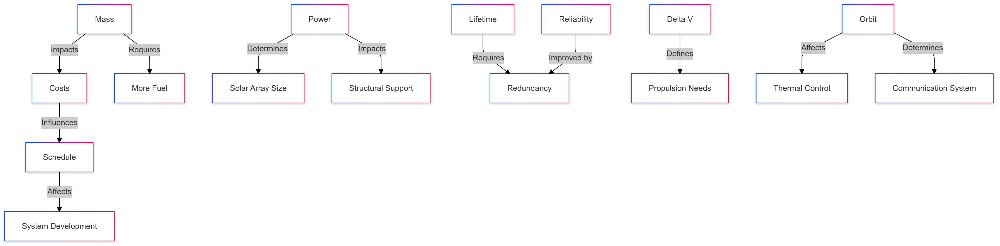

# Spacecraft Design

This note provides a high-level summary of the **Spacecraft Design** lecture.

<aside>
💡

**Contents**

- The iterative design process for spacecraft.
- Major design drivers such as mass, power, cost, schedule, reliability, and lifetime.
- A breakdown of key subsystems and their interdependencies.
- Configuration alternatives in spacecraft design.
- How spacecraft budgets are estimated and managed.
</aside>

Below you will find links to sub-pages for each specific area:

## **Lecture Overview**

1. [**Design Process & Iteration](https://d33pk3rn3l.github.io/sse_page/Topics/Spacecraft-Design-Overview/Design-Process--and--Iteration)** 
    - Mission objectives and payload requirements drive initial architecture.
    - Multiple trade-offs between mass, power, cost, schedule, and reliability.
    - Documentation and stakeholder communication are critical at every phase.
2. [**Design Drivers**](https://d33pk3rn3l.github.io/sse_page/Topics/Spacecraft-Design-Overview/Design-Drivers)
    - Mass: Heavily influences launch vehicle choice and cost.
    - Power: Solar arrays vs. RTGs and their ripple effects on thermal, mass, and cost.
    - Cost & Schedule: Dictate depth of testing, [technology readiness](https://d33pk3rn3l.github.io/sse_page/Concepts/Technology-Readiness-Level), and iterative loops.
    - Reliability & Lifetime: Influence redundancy, component quality, and testing rigor.
    
    
    
3. [**Spacecraft Subsystems**](https://d33pk3rn3l.github.io/sse_page/Topics/Spacecraft-Design-Overview/Spacecraft-Subsystems)
    - Each subsystem (e.g., propulsion, ADC, power, thermal, structures, TT&C, onboard processing) must integrate seamlessly to meet mission goals.
4. [**Configuration Alternatives**](https://d33pk3rn3l.github.io/sse_page/Topics/Spacecraft-Design-Overview/Configuration-Alternatives)
    - Different attitude control methods (spin-stabilized vs. three-axis).
    - Solar array setups (fixed, deployable, sun-tracking).
    - Antenna placements for TT&C.
5. [**Spacecraft Budgets**](https://d33pk3rn3l.github.io/sse_page/Topics/Spacecraft-Design-Overview/Spacecraft-Budgets)
    - Mass, propellant, power, pointing, and data budgets ensure the design remains feasible.
    - Each budget is tracked with built-in margins and contingencies to handle uncertainties.

# **Key Takeaways**

- **Spacecraft design is iterative**—new data and changing requirements continuously refine the spacecraft’s architecture.
- **Trade-off analyses** are vital for reconciling competing constraints: mass ↔ power ↔ cost ↔ reliability ↔ schedule.
- **Subsystems** must be coordinated to avoid local optimizations that jeopardize overall mission success.
- **Budgets** (mass, power, data, propellant) are crucial and carry contingency to manage design risks.

## **Learning Objectives**

| **Area** | **Skills & Knowledge** |
| --- | --- |
| Design Process | - Understanding the iterative design cycle
- Linking mission objectives to bus development
- Translating payload requirements into design decisions |
| Design Drivers | - Evaluating mass constraints
- Analyzing power requirements
- Managing cost limitations
- Handling schedule constraints
- Setting reliability targets
- Planning for mission lifetime
- Understanding driver interdependencies |
| Subsystem Integration | - Identifying major spacecraft subsystems
- Analyzing subsystem interdependencies
- Managing integration challenges between propulsion, attitude control, power, thermal, and other systems |
| Configuration & Architecture | - Comparing spacecraft configurations
- Evaluating attitude control options
- Assessing propulsion alternatives
- Analyzing solar array layouts
- Optimizing communication systems
- Understanding performance impacts |
| Budget Management | - Developing mass budgets
- Calculating power requirements
- Managing propellant budgets
- Defining pointing requirements
- Planning data handling capacity
- Monitoring design evolution |

[Tenzins Spacecraft design overview](Tenzins%20Spacecraft%20design%20overview%20171607ce73f88025bfb5d33fe1840073.md)