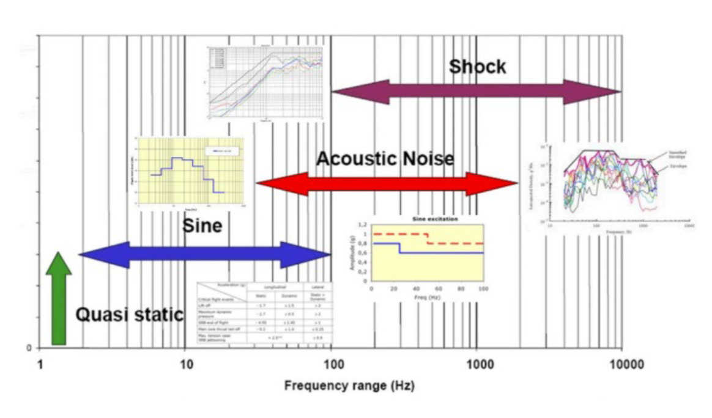
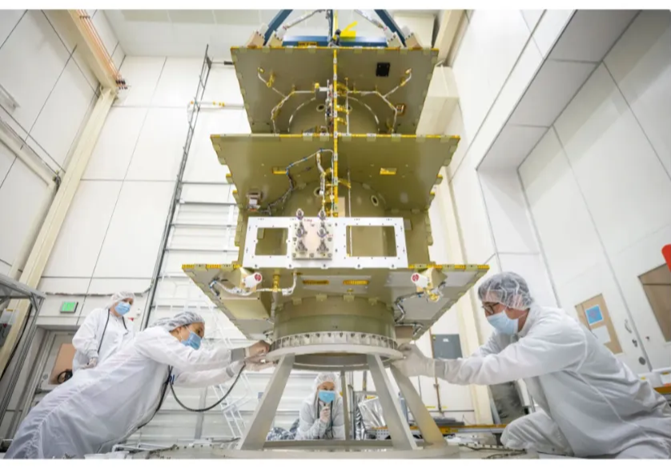
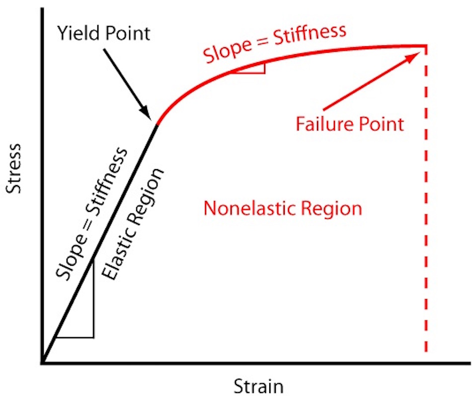

# Structure & Thermals

> “Usually the Spacecraft Structure is the subsystem for which requirements are available last, but the physical element that is needed first when the spacecraft has to be assembled”
> 

## Structure

### Requirements Flow down

- **Mission Requirements:** Mission life, orbit & Payload specifications
- **System Requirements:** Satellite bus, propulsion, avionics, deplorables
- **Structural Subsystem Requirements:** Interface loads, materials, alignment, mass, Center of Gravity

### Types of Requirements

- **Performance:** Pointing, stability, orbit parameters
- **Environment:** Thermal, outgassing, radiation, loads (static, dynamic)
- **Interface:** Alignments, mechanical Interface Control Document (ICD) CoG, mass
- **Programmatic:** Schedule and cost

---

**Static Loads**

- Acceleration from Launch
- Thermal Loads

**Dynamic Loads**

- Sine Vibrations: Rocket
- Random Vibrations: Acoustic Pressure
- Shock: High frequency - pyrotechnics (separation)

### Structural Calssification:

- **Primary:** Main load path to launch vehicle, designed for stiffness and strength. Examples include satellite bus, launch vehicle adapter.
- **Secondary:** Mounting for payloads, solar arrays, antennas. They behave like sub-structures when deployed in orbit. Examples include appendage booms, support trusses.
- **Tertiary:**  Often monolithic, driven by stiffness and positional stability, and are often sensitive to base-driven vibration. Examples include brackets, component housings.

**Primary Structures**

Satellite bus, launch vehicle adapter

**Secondary Structures**

appendage booms, support trusses, platforms, solar panels, antenna dishes

**Tertiary Structure**

Brackets, component housing, electronic boxes, cable supports

---

### Design Process

1. **Initial Configuration**: Conceptual design, system-level.
2. **Preliminary Design**: Trade studies, material selection.
3. **Detailed Analysis**: Sizing components, creating drawings.
4. **Production**: Manufacturing and supply chain.
5. **Testing**: Qualification, acceptance, and workmanship tests.

---

### Materials

- **Requirements**: Must be strong, lightweight, thermally stable, and resistant to space conditions.

**Mechanical Properties**:

- Strength-to-weight ratio
- Young's modulus
- Fatigue resistance

**Thermal Properties**:

- Thermal expansion coefficient (CTE)
- Thermal conductivity

**Environmental Resistance**:

- Outgassing
- Radiation resistance
- Corrosion resistance
- **Common Materials**:
    - **Aluminium**: Lightweight, good conductivity
    - **Titanium**: High strength, lower CTE
    - **Polymer composites (CFRP, GFRP)**: Lightweight, customizable, used for complex shapes like sandwich panels
    - **Steel and Ni/Cr superalloys**: High strength for bolts and high-load structures
    - **Ceramics**: Thermal protection systems (TPS)

---

### Testing

- **Static Load Testing**: Applying loads to measure structural response.
- **Modal Survey**: Sine sweep tests to determine natural frequencies and damping.
- **Acoustic Testing**: Simulating launch noise in a reverberant chamber.
- **Random Vibration Testing**: Using a shaker to simulate random vibrations.
- **Shock Testing**: Simulating pyrotechnic shocks.

---

## Thermals

**Purpose**: Maintain temperatures of all spacecraft components within their designed operating ranges.

---

### Heat Transfer Mechanisms

- **Conduction**: Heat transfer within a material or between materials in contact.
- **Convection**: Heat transfer through fluid movement, **not present in space.**
- **Radiation**: Heat transfer via electromagnetic radiation.

---

### Thermal Balance

- Equilibrium between energy absorbed and dissipated by the spacecraft.

---

### Radiant Energy

- **Direct Solar Flux**: Energy from the sun, dependent on distance and orientation.
- **Albedo**: Reflected solar energy from a planet.
- **Planetary Infrared Energy**: Infrared radiation from a planet.
- **Radiated Energy**: Heat emitted from the spacecraft into space.

—> Earth reflects 25-55% of the incident solar energy

---

### Thermal Control Hardware

- **Passive**:
    - Multi-Layer Insulation (MLI): Layers of low-emittance film with thermal spacers.
    - Conductive Isolators: Thermal stand-offs made of non-metallic material.
    - Thermal Fillers: Conductive materials between surfaces.
    - Surface Coatings: Materials with specific absorptivity (α) and emissivity (ε) values.
    - Radiators: External panels to reject waste heat, often with mirrors (OSR).
- **Active**:
    - Heaters: Electrical resistance elements for generating heat.
    - Heat Pipes: Devices that transfer heat via a two-phase process using capillary action.

—> needs to be tested in vacuum chamber to simulate space thermal environment

---

## Memorize:

- **Natural Frequency:**  Frequency at which structure resonates. Important to avoid matching the natural frequency of the spacecraft with frequencies of the launcher.
- **Stiffness:** Measure of a Structure’s resistance to deformation: Force/Displacement

### Structural Subsystem

- **Loads**: Static, Sine Vibration, Random Vibration, Shock
- **Key Structural Properties**: Stiffness, Natural Frequency, Mass, CoG
- **Primary Structure**: Main load-bearing, stiffness, launch vehicle adapter.
- **Secondary Structure**: Mounting, deplorables.
- **Tertiary Structure**: Brackets, component housings, positional stability, high frequency base-driven vibrations.
- **ICD**: Interface Control Document.
- **FEA**: Finite Element Analysis.
- **Structural Testing**: Static load, modal survey (sine sweep), acoustic, random vibration, shock.
- **CTE**: Coefficient of Thermal Expansion.

### Thermal Subsystem Summary

- **Heat Transfer**: Conduction, radiation (no convection in space).
- **Thermal Balance**: Energy absorbed = energy emitted.
- **Radiant Energy Sources**: Direct solar, albedo, planetary infrared, radiated to space.
- **MLI**: Multi-Layer Insulation.
- **Absorptivity (α)**: Measures energy absorption from solar radiation.
- **Emissivity (ε)**: Measures energy emitted in the infrared spectrum.
- **Heat Pipes**: Passive devices using two-phase flow for heat transfer.
- **OSR**: Optical Solar Reflector.
- **Thermal Testing**: Vacuum chamber tests.