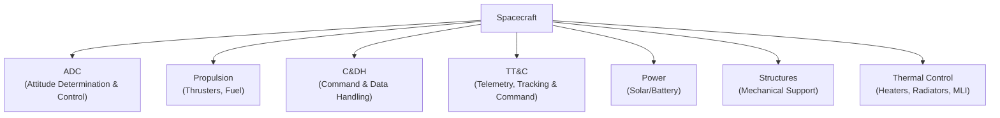

# Spacecraft Subsystems

> [!abstract] **What is a Spacecraft Bus?**  
> The “spacecraft bus” refers to the core framework or “platform” of any satellite or spacecraft. It houses and supports all the critical **subsystems** (e.g., power, propulsion, thermal control) that keep the spacecraft operational and enable the mission payload to do its job.

**Related:** [[Spacecraft Design Overview]]

---

## Subsystems

### 1. **[[Attitude Determination and Control System|ADC]]**
> **Tagline:** *Ensures precise pointing using sensors and actuators.*  

- **Main Role:** Maintains correct spacecraft orientation (pointing instruments, antennas, solar arrays).  
- **Techniques:**  
  - Spin-stabilized: Simple but limited pointing accuracy.  
  - Three-axis stabilized: Precision pointing with reaction wheels or Control Moment Gyros (CMGs).  
  - Momentum dumping via thrusters or magnetotorquers if wheels saturate.  
- **Sensors:** Star trackers, sun sensors, horizon sensors.

### 2. **[[Spacecraft Propulsion System|Propulsion]]**
> **Tagline:** *Provides the ability to alter orbit or momentum for maneuvers.*  

- **Main Role:** Offers ΔV for orbit insertion, station-keeping, maneuvers.  
- **Types:**  
  - Cold gas or mono-propellant (low ΔV).  
  - Bi-propellant or electric/ion propulsion (high ΔV, more efficient but complex).  
- **Key Point:** Fuel storage and thruster placement strongly influence spacecraft layout.

### 3. **[[Command and Data Handling|C&DH]]**
> **Tagline:** *Executes commands and processes payload data.*  

- **Main Role:** Heart of onboard computing—receives, interprets, and executes ground commands; handles data processing and storage.  
- **Reliability:** Typically rad-hard, robust architecture, sometimes redundant for fault tolerance.  
- **Data Storage:** Buffers scientific and housekeeping data when downlink isn’t possible.

### 4. **[[Telemetry Tracking and Command|TT&C]]**
> **Tagline:** *Handles all communication between spacecraft and ground stations.*  

- **Main Role:** Communicates spacecraft health/status (telemetry) and receives instructions (uplink).  
- **Tracking:** Tracks spacecraft location and velocity for orbit determination.  
- **Antenna & Power:** Antenna size and transmitter power depend on distance and data rate needs.

### 5. **[[Spacecraft Power System|Power]]**
> **Tagline:** *Generates, stores, and distributes electricity to all subsystems.*  

- **Generation:** Typically solar arrays (sometimes RTGs for deep-space).  
- **Storage:** Batteries for eclipse or night side operations.  
- **Distribution:** Regulated bus ensures each subsystem receives stable power.

### 6. **[[Spacecraft Structure and Mechanisms|Structures]]**
> **Tagline:** *Provides the mechanical backbone to support and protect hardware.*  

- **Main Role:** Must withstand launch loads, vibrations, temperature extremes.  
- **Materials:** Often uses lightweight composites (e.g., CFRP, aluminum honeycomb).

### 7. **[[Spacecraft Thermal Control System|Thermal Control]]**
> **Tagline:** *Maintains temperatures within operational limits.*  

- **Methods:**  
  - Passive: MLI (multi-layer insulation), radiators, surface coatings.  
  - Active: Heaters, cryocoolers, fluid loops.  
- **Drivers:** Orbit (sun exposure), internal heat generation, required instrument temperature stability.

> [!tip] **Design Flexibility**  
> These seven subsystems are typical, but some missions may combine or split them differently. For instance, a small CubeSat might merge C&DH and TT&C into a single board.”

